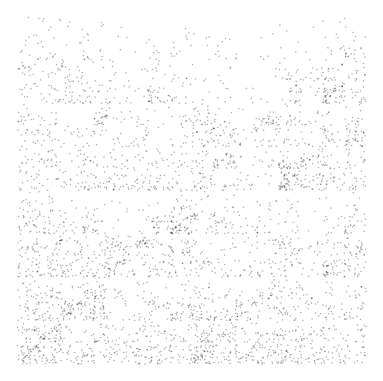
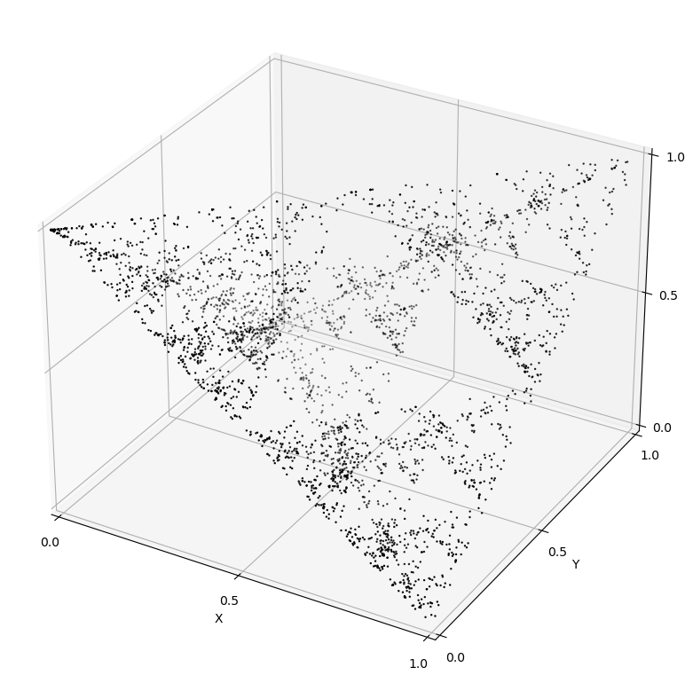

# FastaCGR


A Python script to generate 2D and 3D Chaos Game Representation (CGR) plots from sequences in a multi-FASTA file.

## Features

- Generates both 2D and 3D CGR plots for each sequence.
- Supports parallel processing for faster computation.
- Customizable colormap for the plots.
- Detailed logging of the processing steps.
-  2D CGR can handle different sequence lengths using frequency counts (FCGR) with k > 1

## Gallery



2D CGR representation for gene NM_000903.3 [Homo sapiens NAD(P)H quinone dehydrogenase 1 (NQO1]



3D CGR representation for gene NM_000903.3 [Homo sapiens NAD(P)H quinone dehydrogenase 1 (NQO1]


2D FCGR (k=4) representation for gene NM_000903.3 [Homo sapiens NAD(P)H quinone dehydrogenase 1 (NQO1]

## Requirements

- Python 3.x
- numpy
- matplotlib

## Usage

```
python src/cgr_generator.py data/input_sequences.fasta -o output/images --cmap plasma --processes 8
```
### Arguments:
```
input: Path to the input FASTA file.
-o, --output: Output directory to save the plots (default: output/images).
--width: Image width in pixels (default: 800).
--height: Image height in pixels (default: 800).
--kmer: Length of k-mers for FCGR (default: 1 for standard CGR).
--cmap: Colormap for the plots (default: viridis).
--processes: Number of parallel processes (default: number of CPU cores).
```

### Generate Standard CGR Images

To generate standard CGR scatter plots (k=1):
```
python src/cgr_generator.py sequences.fasta -o output/images --kmer 1
```
This will generate 2D and 3D CGR images for each sequence in the FASTA file.

### Generate FCGR Images

To generate FCGR heatmaps (k > 1), for example with k=4:
```
python src/cgr_generator.py sequences.fasta -o output/images --kmer 4
```
This will generate 2D and 3D FCGR images for each sequence in the FASTA file

## Work in progress
